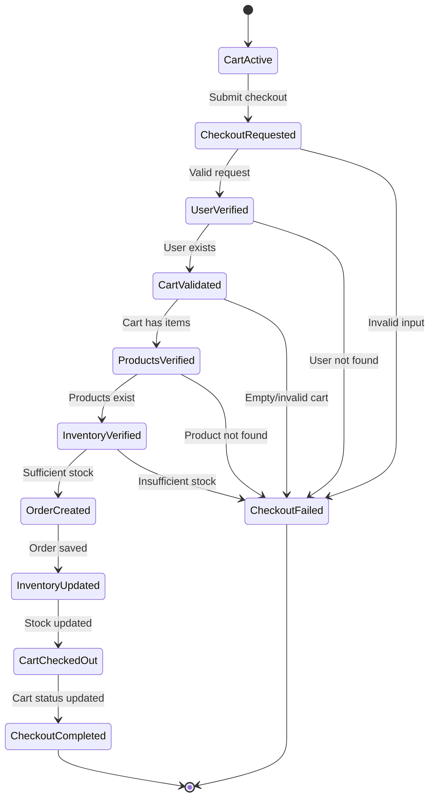

# Checkout Business Workflow

## Overview
The checkout workflow moves a customer from an active cart to a confirmed order. It validates the user, cart, products, and inventory, creates the order and order items, updates inventory, and completes the cart checkout.

## State Transitions

| State | Transition | Business Rule |
|---|---|---|
| Cart Active | Submit checkout | User and request data must be valid |
| Checkout Requested | User Verified | User must exist |
| User Verified | Cart Validated | Cart must exist and contain items |
| Cart Validated | Products Verified | Every cart product must exist |
| Products Verified | Inventory Verified | Requested quantity must be available |
| Inventory Verified | Order Created | Order is created from cart items |
| Order Created | Inventory Updated | Purchased quantity is deducted |
| Inventory Updated | Cart Checked Out | Cart is marked completed |
| Cart Checked Out | Checkout Completed | Successful response is returned |
| Any state | Checkout Failed | Validation/database/business-rule failure stops checkout |

## Checkout Flow

## Business Rules

- A checkout request must reference an existing user.
- The cart must exist and contain at least one item.
- Every product in the cart must exist.
- Available inventory must be sufficient for the requested quantity.
- An order and its order items are created from the cart.
- Inventory is reduced after successful order creation.
- The cart is marked as checked out after successful processing.
- Database failures must roll back the transaction to avoid partial updates.
- Payment verification and discount application are future workflow stages unless those modules are implemented.

## Failure Scenarios

| Scenario | Expected Result |
|---|---|
| Invalid input | Request rejected |
| User not found | 404 error |
| Cart empty/invalid | Checkout rejected |
| Product not found | 404 error |
| Insufficient stock | Checkout rejected/conflict |
| Database failure | Rollback and 500 error |
| Payment failure (future) | Order confirmation stopped |
| Invalid discount (future) | Discount rejected according to business rules |

## Key Findings

1. Validate dependencies before changing inventory.
2. Order and inventory updates should be handled transactionally.
3. Clear failure states prevent invalid orders.
4. Payment and discount processing can be added as separate stages.
5. The workflow should be reviewed with stakeholders before production use.

## Stakeholder Validation

No stakeholder feedback was available for this task. The workflow is based on the current checkout implementation and documented business rules. Team/stakeholder review should be completed before treating it as the final production specification.
